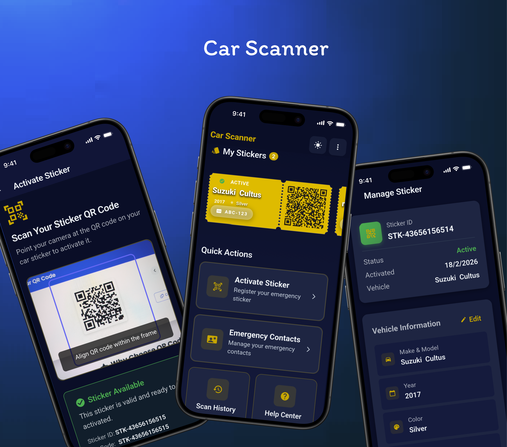
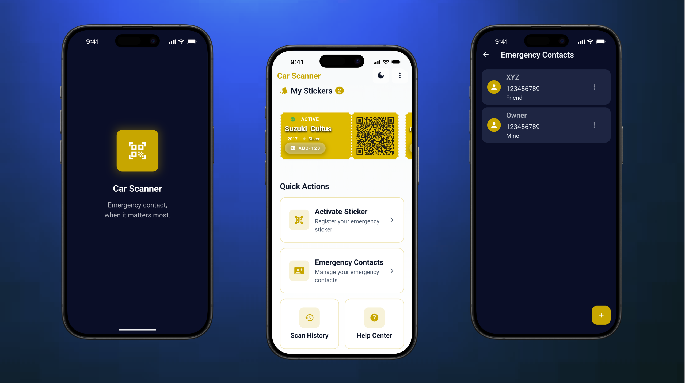
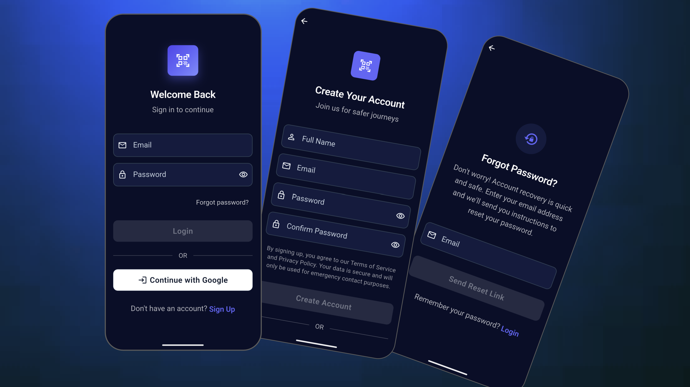

# ScanZoO - Car Scanner

ScanZoO is an emergency vehicle sticker system built with Flutter and Firebase.

People can scan a sticker QR code and instantly see emergency contacts for that specific vehicle.

## Screenshots








## Project Parts

- Mobile app: user login, sticker activation, emergency contacts, scan history
- Public website: QR scan page for emergency lookup
- Admin website: create and manage stickers

## Security Status

This repository has been cleaned to avoid exposing confidential Firebase setup values in tracked files.

The following files now use placeholders or local ignored config:

- lib/firebase_options.dart
- android/app/google-services.json
- scan_website/js/firebase-config.js (ignored by git)

## How To Configure Before Use

You must add your own Firebase project configuration locally.

### 1. Web Config (public website + admin)

1. Copy:

	scan_website/js/firebase-config.example.js

2. Create:

	scan_website/js/firebase-config.js

3. Fill with your Firebase Web App values.

Note: scan_website/js/firebase-config.js is ignored by git and should not be committed.

### 2. Flutter Mobile Config

Choose one of these methods:

1. Recommended: run FlutterFire CLI and regenerate mobile config files.
2. Manual: replace placeholders in:
	- lib/firebase_options.dart
	- android/app/google-services.json
	- ios/Runner/GoogleService-Info.plist (if iOS build is used)

## Firestore Rules

Deploy rules before testing production behavior:

```bash
firebase deploy --only firestore:rules
```

## How Users Use The System

### A. Admin Flow

1. Open admin page at /admin.
2. Login with Firebase email/password account.
3. Add new sticker IDs.
4. Print QR codes pointing to /scan/{stickerId}.

### B. App User Flow

1. Sign up or login in the mobile app.
2. Activate a sticker ID.
3. Add vehicle information.
4. Add emergency contacts.
5. Link selected contacts to the sticker.

### C. Public Scanner Flow

1. Scanner opens /scan/{stickerId}.
2. Website checks sticker status.
3. Website shows public emergency contacts for that sticker.
4. Scan event is logged in scanHistory.

## Deploy Guide

### 1. Deploy Website

Deploy scan_website directory to Netlify (or any static host).

Required routes:

- /scan/:stickerId
- /admin

### 2. Deploy Mobile App

- Android: build and publish signed AAB/APK
- iOS: archive and publish from Xcode

### 3. Verify End To End

1. Create a sticker in admin page.
2. Activate it from app and link contacts.
3. Open QR scan URL and verify contacts are displayed.
4. Confirm scanHistory document appears in Firestore.

## Important Note For Existing Stickers

If stickers were activated before this version, relink contacts once so each sticker stores publicEmergencyContacts for website display.

## Tech Stack

- Flutter
- Firebase Auth
- Cloud Firestore
- BLoC

## License

Private project. All rights reserved.
